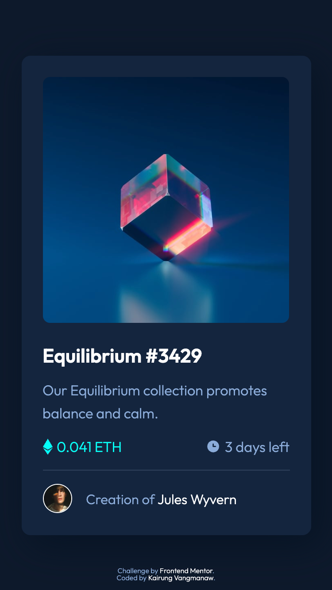
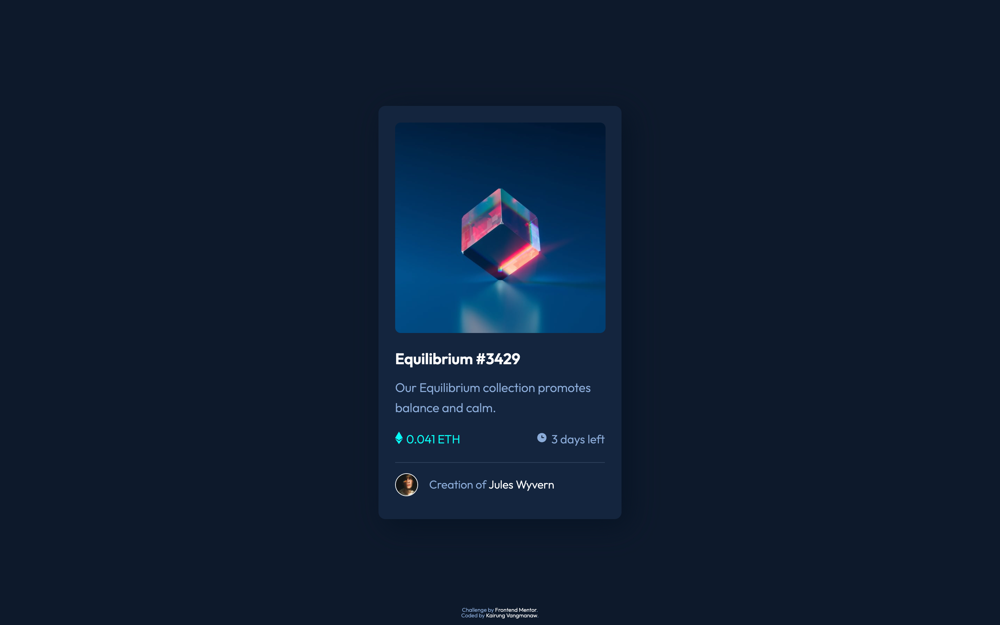
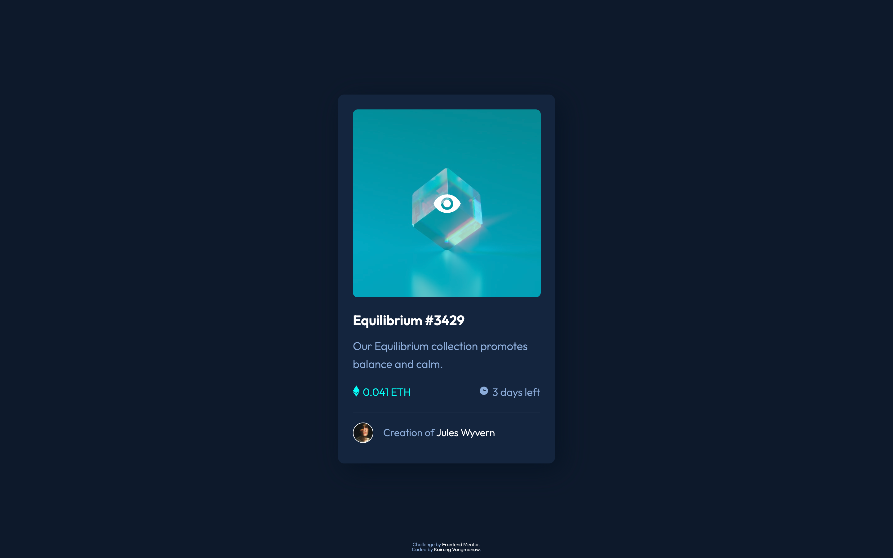
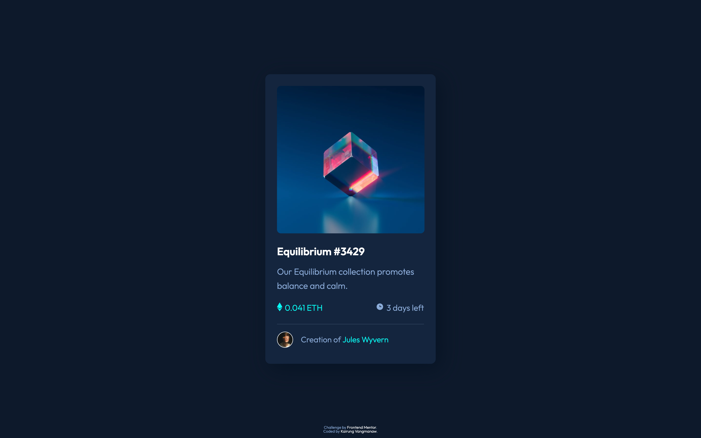

# Frontend Mentor - NFT preview card component solution

This is a solution to the [NFT preview card component challenge on Frontend Mentor](https://www.frontendmentor.io/challenges/nft-preview-card-component-SbdUL_w0U). Frontend Mentor challenges help you improve your coding skills by building realistic projects.

## Table of contents

- [Frontend Mentor - NFT preview card component solution](#frontend-mentor---nft-preview-card-component-solution)
  - [Table of contents](#table-of-contents)
  - [Overview](#overview)
    - [The challenge](#the-challenge)
    - [Challenge result](#challenge-result)
    - [Screenshot](#screenshot)
    - [Links](#links)
  - [My process](#my-process)
    - [Built with](#built-with)
    - [What I learned](#what-i-learned)
    - [Continued development](#continued-development)
  - [Author](#author)
  - [Acknowledgments](#acknowledgments)

**Note: Delete this note and update the table of contents based on what sections you keep.**

## Overview

### The challenge

Users should be able to:

- View the optimal layout depending on their device's screen size
- See hover states for interactive elements

### Challenge result

- 18 Sep 2025
  - ✅ View the optimal layout depending on their device's screen size
  - ✅ See hover states for interactive elements

### Screenshot

- Mobile view

  

- Desktop view

  

- Active State view

  

  

  

### Links

- Solution URL: [NFT Preview Card Component using HTML and CSS](https://www.frontendmentor.io/solutions/test-g1lBi2QCxd)
- Live Site URL: [Frontend Mentor Challenge | NFT preview card component](https://vangmanawkairung.github.io/frontend-mentor-nft-prview-card-component/)

## My process

### Built with

- Semantic HTML5 markup
- CSS custom properties
- Flexbox
- Mobile-first workflow
- Absolute positioning
- Drop shadow & hover effects
- Google Fonts (Outfit)

### What I learned

- Learned how to use **pseudo-elements (::before)** together with `position: absolute` and `inset: 0` to create an overlay effect without adding extra HTML tags.
- Understood the relationship between **position: relative** (as the parent reference point) and **position: absolute** (as the child positioned element). The absolute child aligns to the nearest ancestor with a defined position.
- Practiced controlling **stacking order** with `z-index` to ensure that the overlay and the icon display correctly when hovering.
- Discovered that `:hover` must be applied to the **parent container** (e.g., `section.nft-image`) instead of the pseudo-element or the `` itself, to trigger overlay and icon display together.
- Strengthened understanding of **responsive design** by using a mobile‑first workflow and `@media (min-width: 1024px)` queries to adjust layout and font sizes for larger screens.
- Improved hover interaction styling for elements like the title (`h1`) and the creator name by changing colors on hover to provide better user feedback.
- Applied **CSS custom properties (variables)** to manage colors, font sizes, and weights consistently across the project.

### Continued development

In future development, I would like to:

- Implement a feature where clicking on the NFT image expands it into a larger modal view, instead of only showing an overlay icon on hover.
- Extend the project to support multiple NFT cards, and add navigation controls (such as arrows or a carousel) so users can browse through them interactively.

## Author

- GitHub: [Kirung Vangmanaw](https://github.com/VangmanawKairung)
- Frontend Mentor - [@VangmanawKairung](https://www.frontendmentor.io/profile/VangmanawKairunge)

## Acknowledgments

I would like to sincerely thank myself for staying persistent and continuing to push forward. A big thank you to the **Frontend Mentor team** for creating this challenge and giving me the opportunity to practice and improve my skills. I am also grateful to **OpenAI** and **Google** for developing **ChatGPT** and **Gemini**, which helped me complete this challenge and explore new techniques. A special thanks to **Figma** for providing an intuitive design tool that made translating designs into code much smoother. Lastly, I want to express my appreciation to every tool, program, and source of encouragement that supported me throughout this process. Without them, completing this challenge successfully would not have been possible.
